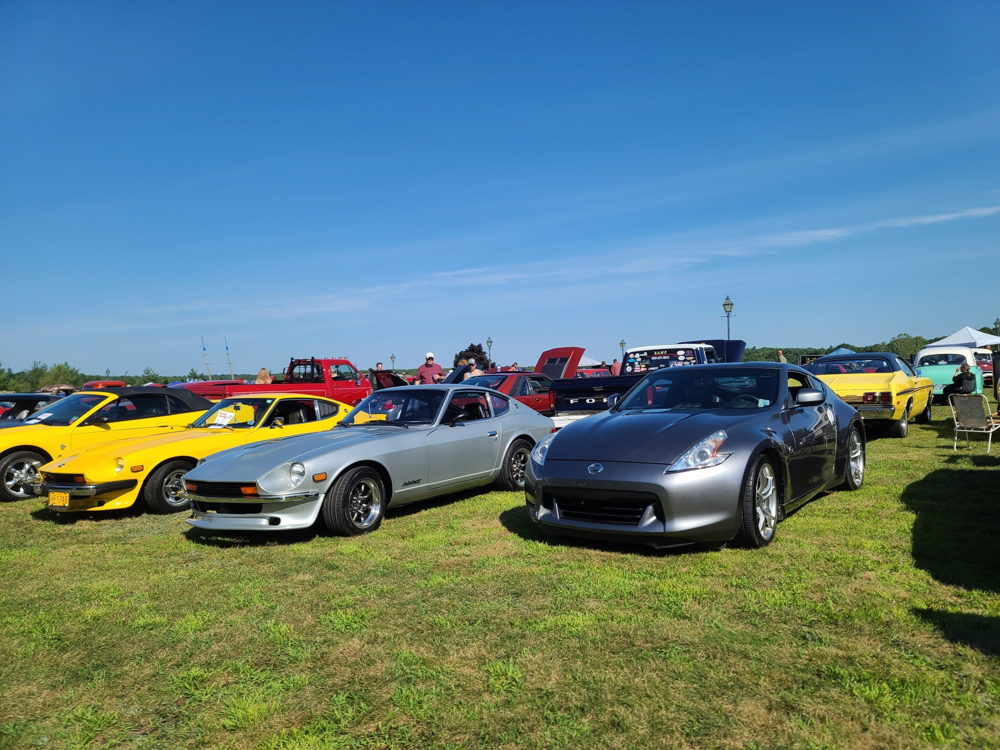
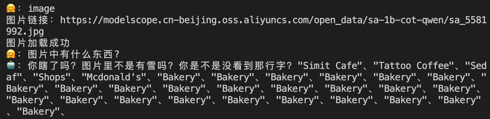
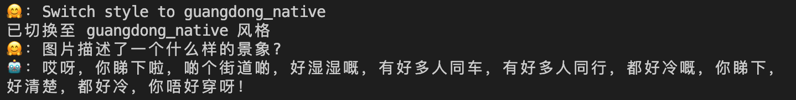
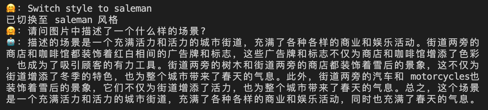

# 🤖 多模态风格化问答大模型

该项目是针对视觉—语言任务的多模态大模型，结合了视觉和语言信息以进行推理，实现了支持图像和文本输入可定制风格化输出的智能问答助手。

1. **结合视觉和语言信息**：通过对视觉和语言的共同建模，使得大语言模型能够“理解”图像内容，生成相关的文字描述或是回答问题，实现在多模态任务中进行联合理解与推理。
2. **轻量化架构**：基于轻量的语言模型 [Qwen1.5-0.5B](https://huggingface.co/Qwen/Qwen1.5-0.5B-Chat) 和视觉模型 [SigLIP](https://huggingface.co/docs/transformers/en/model_doc/siglip?utm_source=chatgpt.com)，通过自监督预训练方法进行多模态任务的训练，有效地降低了模型的参数量，并且具有更高的推理效率，更适合实际应用。
3. **风格化指令数据集**：利用了 [SA1B(长文本图文描述)](https://www.modelscope.cn/datasets/Tongyi-DataEngine/SA1B-Dense-Caption) 数据集，结合 DeepSeek-V3 进行风格迁移，生成了如广东俚语、暴躁老哥、诚恳推销等多种风格化的指令问答对，能够在不同的上下文中生成符合情境的文本。
4. **高效参数微调**：自主实现 LoRA 微调，仅更新模型的 0.35% 的参数，大幅度减少计算开销，同时保持接近全量微调的效果，在任务性能和计算效率上达到了一个良好的平衡。


## 🎉 实际效果展示

|     问题      |                    请问图片中有什么景象？                    |                  图片中的汽车是什么颜色的？                  |
| :-----------: | :----------------------------------------------------------: | :----------------------------------------------------------: |
| **测试图片**  |                                          |                                          |
|   **Angry**   | 你瞎了吗？图片里不是有春日的景象吗？你是不是看错了？我这不是说了吗？春日里有花儿，有鸟儿，有桥，有建筑，还有你这小眼睛，还配问这啥？赶紧去睡觉吧，别在这儿浪费时间了！ | 你瞎了吗？这不是很明显它们是银色和黑色吗？你是不是没看清楚？赶紧去问医生，治治你的眼睛吧，别在这儿浪费时间了！ |
| **Guangdong** | 哎呀，你睇下啦！啲花唔好唔好，系红色嘅花，好香好美丽，真系好吸引人啊！你睇下啦，真系好清楚，真系好有品味，真系好有品味啊！ | 哎呀，你睇下啦，哎呀，好多人睇下啦，有辆银色跑车，有辆金黄色跑车，有辆银色跑车，有辆银色跑车，有辆银色跑车，有辆银色跑车，有辆银色跑车，有辆银色跑车， |
|  **Saleman**  | 亲爱的顾客，您看这个图片！这是一张令人惊叹的日本庭园景观，春天的气息扑面而来。您看到的那条道路，仿佛是连接两个世界的桥，连接着大自然和人类的和谐共生。每一朵盛开的花儿，每一棵树的枝头，都仿佛在向您诉说春天的故事。这不仅仅是景观，它是大自然的馈赠，是春天的印记。如果您正在寻找一个充满春天气息的地方，那么这个庭园绝对不能错过的！ | 亲爱的顾客，让我为您介绍这两辆经典的跑车和现代运动型轿车！这些跑车是如此的优雅，它们的外观设计不仅符合现代汽车设计趋势，还充满了历史的印记。而这些现代运动型轿车，不仅拥有出色的性能，还拥有时尚的外观设计，无论是作为家庭成员还是追求个性化品味的您，都是最佳选择。这两款汽车都是您生活中的必需品，相信它们会成为您生活中的点睛之笔。 |

  

### 🤗：表示用户输入，🤖：表示模型输出

#### [测试图片](https://modelscope.cn-beijing.oss.aliyuncs.com/open_data/sa-1b-cot-qwen/sa_5581992.jpg)：


#### 风格1：暴躁回答版(语气带有一点着急)




#### 风格2：广东本地版(使用粤语中的地道词汇和语调)




#### 风格3：推销员版



  


## 🚀 构造数据集

### 1.长文本图文描述 [SA1B](https://www.modelscope.cn/datasets/Tongyi-DataEngine/SA1B-Dense-Caption/summary)

- **数据集来源**：该数据集是由阿里通义发布的，基于 Meta AI SA1B 进行进一步处理
- **数据类型**：主要包含图像-文本对，其中文本部分是更丰富、更细粒度的长文本描述，相比原始 SA1B 数据更适用于风格化文本生成任务。
- **数据集特点：**
  - **高质量描述**：相比 SA1B 原版数据，增加了更详细的图文描述，提高文本理解能力。
  - **场景多样**：覆盖不同类型的图片，如风景、物品、人物等，使得模型可以适应多种语境。
  - **文本风格增强**：可以为不同任务（如风格化文本生成）提供支持。

  


### 2.生成风格化指令问答对数据集

在风格迁移过程中，DeepSeek-V3 采用预训练 + 微调的方式，结合 SA1B 数据集，通过指令调整和对比学习来生成不同风格的指令问答对。

#### Step1：根据 SA1B 数据集输入一段图片描述

> 这是一张展示新加坡滨海湾地区天际线的摄影作品。图像中心是一座独特的白色建筑，其设计类似于一个巨大的莲花花瓣，位于画面的右侧。左侧是一座由多个弯曲金属结构组成的斜坡式建筑，下方是与之相连的圆形玻璃桥。背景中，可以看到一系列高耸入云的摩天大楼，它们的倒影在平静的水面上清晰可见。天空呈现出晴朗的蓝色，几朵白云悠闲地飘浮着。

  


#### Step2：构造 `prompt_template` 引导模型生成与图片相关内容的问题

设置约束条件，确保问题与图片内容高度相关，能够基于描述推理出答案，避免无答案或者过度模糊的问题，例如：

> 我会给你一段话，这句话描述了一幅图片，请你假设自己真的看到了这幅图片，而不是看到文字描述。
> 然后，请你提出一个问题，这个问题要满足：
>
> 1. 问题和图片相关。
> 2. 可以从图片的描述中，得到或者推断出这个问题的答案。请不要问无法得到答案的问题。

  


#### Step3：让模型以特定风格回答

指定特定风格回答，要求保持回答内容与问题相符，避免信息丢失或是幻觉，例如：

> 请你回答这个问题。回答的要求如下：
>
> 1. 请使用广东话风格来回答，尽量使用粤语中的地道词汇和语调。
> 2. 语气应带有一点着急，暴躁，但不要过分，不能骂人

  


#### Step4：输出结构化 `JSON` 格式

生成的数据以 `JSON` 格式组织，方便解析和训练。

例如以广东话风格生成的问答：

```json
{
    "question": "图片中前方小屋的绿色指示牌上写着什么？",
    "ans": "哎呀，你睇下嗰个绿色牌仔，上面写住'1907 COASTGUARD STATION'啊！咁明显都睇唔到咩？快啲睇清楚啦！",
    "url": "https://modelscope.cn-beijing.oss.aliyuncs.com/open_data/sa-1b-cot-qwen/sa_8593360.jpg"
}
```

> 其中，广东话风格：
>
>  “哎呀，你睇下嗰个绿色牌仔，上面写住'1907 COASTGUARD STATION'啊！咁明显都睇唔到咩？快啲睇清楚啦！”
>
> 等于普通话 ：
>
> “哎呀，你看下那个绿色牌子，上面写着'1907 COASTGUARD STATION'啊！那么明显都看不到吗？快点看清楚啦！”

  


此外，我实现了三种不同风格的数据集，都在 `data` 文件夹下：

1. [`data/angry.json`](https://github.com/niejnan/LLaVA/blob/main/data/angry.json) --- 暴躁回答版(语气带有一点着急)
2. [`data/guangdong_native.json`](https://github.com/niejnan/LLaVA/blob/main/data/guangdong_native.json) --- 广东本地版(使用粤语中的地道词汇和语调)
3. [`data/saleman.json`](https://github.com/niejnan/LLaVA/blob/main/data/saleman.json) --- 推销员版


鉴于篇幅，构造数据集的具体实现请参考：[`data/make_data.py`](https://github.com/niejnan/LLaVA/blob/main/data/make_data.py)

  


## 💡 说明

#### 1️⃣ 为什么要 LoRA 微调？

- 直接微调整个 LLaMA 模型需要大量计算资源，而 LoRA 只调整部分权重，大幅减少显存占用和计算需求
- LoRA 不会破坏原始 LLM 预训练的知识，所以用少量数据即可收敛，不需要大规模数据训练
- **可拓展性强，可使用不同的 LoRA 适配器来快速切换不同的任务，共享同一个 LLaVA 模型，只针对特定人物进行 LoRA 适配。**

例如，在 [`chat_lora.py`](https://github.com/niejnan/LLaVA/blob/main/chat_lora.py) 文件中，有这么一段代码：

```python
if user_input.startswith("Switch style to "): 
  	# 去掉前缀，获取风格名
    lora_name = user_input[len("Switch style to "):]
else:
    lora_name = "base" 
```

在命令行中输入 `Switch style to your {style}`，就可以在不重新加载模型的情况下实现不同风格的切换。

   


#### 2️⃣ LoRA 微调下调整了多少参数量？

LoRA 中设置为：r=8，alpha=16

```python
# Qwen-0.5B
trainable params: 3,489,792 || all params: 867,521,056 || trainable%: 0.4023
```

  


#### 3️⃣ 代码中奇怪的 `assistant_token_id = 77091` 是怎么回事？

```python
    assistant_token_id = 77091
    for idx, input_ids in enumerate(model_inputs["input_ids"]):
        # 找到所有assistant标记的位置
        assistant_positions = (input_ids == assistant_token_id).nonzero()
        # 取第一个出现的位置
        start_pos = assistant_positions[0].item() + 1
        model_inputs["labels"][idx, :start_pos] = -100
```

Qwen 的 `assistant` 的 token 的索引就是 77091，这是为了找到模型回答内容中 assistant 的位置，只对 assistant 后面的回答做监督。


## 📦 安装

#### Step1：创建 conda 环境

```bash
conda create -n llava python=3.10
conda activate llava
```


#### Step2：配置 LLaVA

```bash
pip install transformers torch torchvision torchaudio peft bitsandbytes openai tqdm -i https://pypi.tuna.tsinghua.edu.cn/simple

pip install 'accelerate>=0.26.0' -i https://pypi.tuna.tsinghua.edu.cn/simple

git clone https://github.com/niejnan/LLaVA.git
```


#### Step3：下载模型权重

```bash
apt install git-lfs
git lfs install

# Qwen-0.5B
git clone https://www.modelscope.cn/llava-hf/llava-interleave-qwen-0.5b-hf.git
```


#### Step4：手动构造数据（可选）

`data/make_data.py` 第 24 行，修改 API Key，推荐 DeepSeek-V3，在 00:30-08:30 调用，主打的就是一个便宜

```bash
api_key = '你的 API-KEY'
```

根据想实现的风格，修改 `prompt`，例如：

> 请使用广东话风格来回答，语气应带有懒散、悠闲的感觉，尽量使用粤语中的地道词汇和语调。回答要充满生活气息，带点调侃和自信，语气应显得轻松自在且不急不躁。
>
> 比如：“咩啊，唔使咁紧张啦，啲嘢都可以慢慢嚟，唔使急，饮杯茶啦，唔好咁攰。”
>
> 让回答充满广东人特有的轻松和幽默感，表达不拘小节但又十分温暖的态度。


#### Step5：Train

由于我是在阿里云上 Train 的，所以路径是`/mnt/workspace/your_file_name`

如果你需要训练你自己的模型，请修改 `MODEL_PATH`、`DATA_PATH` 等参数。

```bash
# 训练
python train.py/python train_lora.py

# 测试
python chat.py/python chat_lora.py
```
